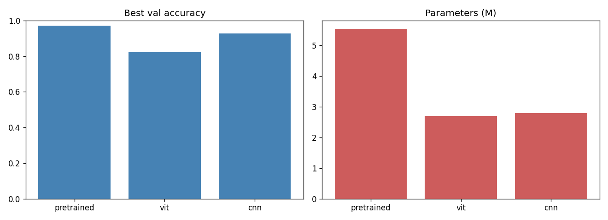
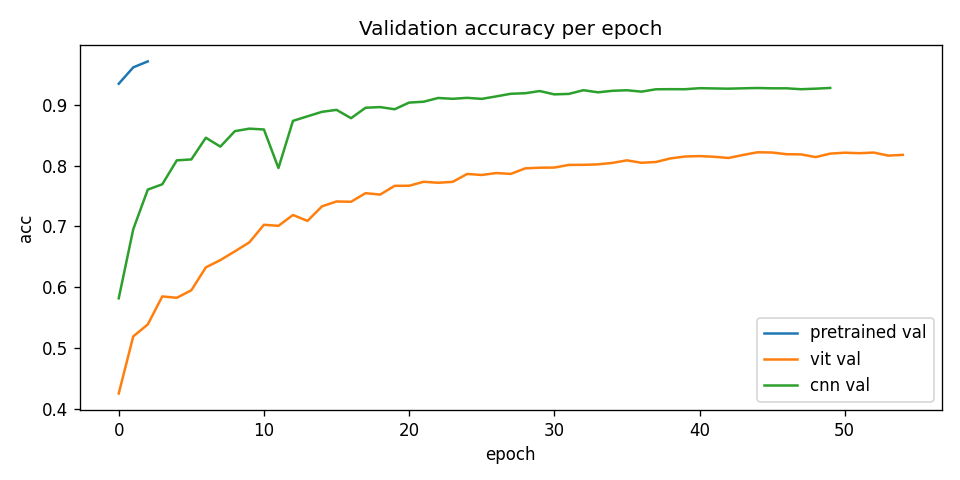
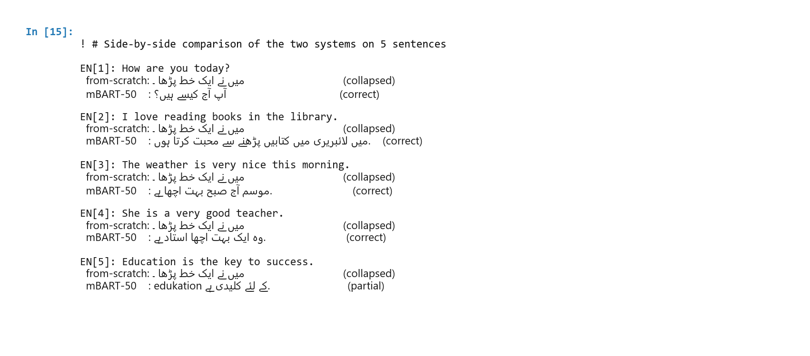
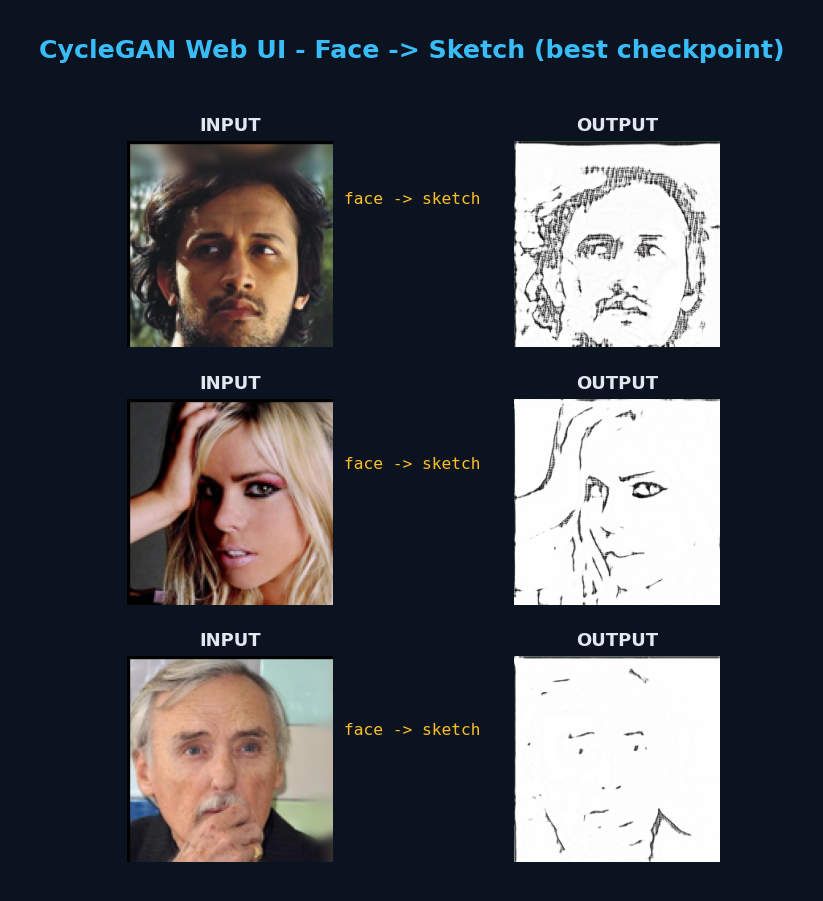
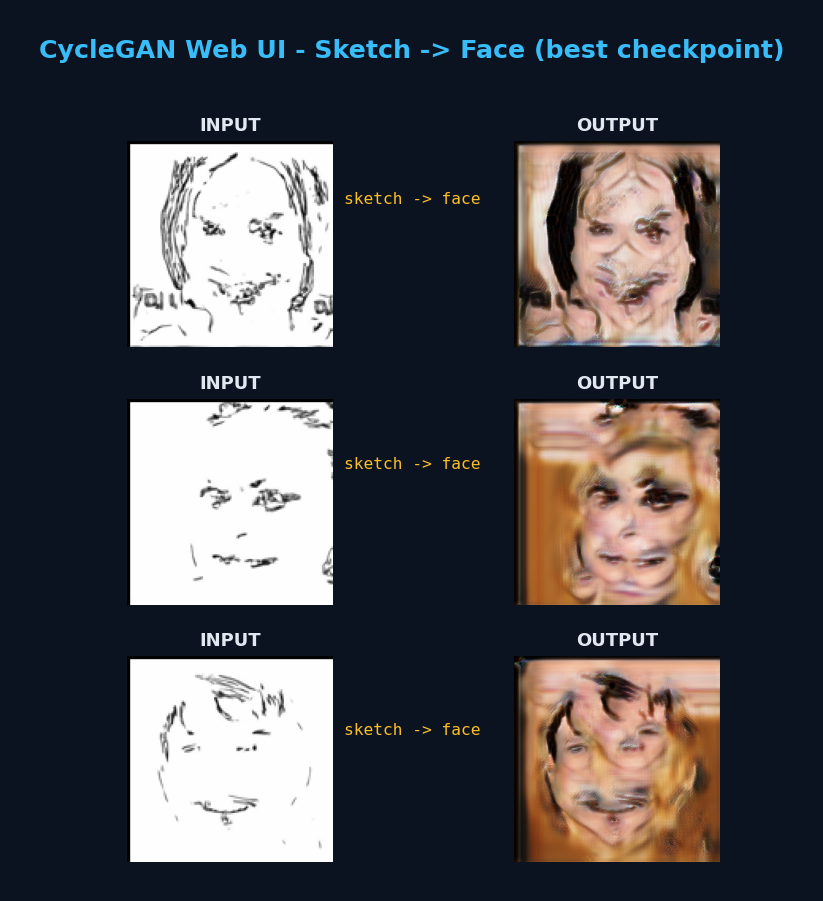

# CycleGAN, Transformer, and Vision Transformer

Three self contained deep learning projects built from the ground up: an unpaired image to image translator, a neural machine translation system, and a side by side study of attention based and convolutional image classifiers. Each project ships with the model code, the exact training scripts that produced the results, runnable notebooks, and a written report.

**Author:** Muhammad Ahmed Mufti

---

## What is inside

| Project | Task | Headline result |
|---------|------|-----------------|
| [Q1: CycleGAN](q1-cyclegan-face-sketch/) | Unpaired face to sketch translation with a Flask web UI | Paper faithful 9 block ResNet generator and 70x70 PatchGAN discriminator |
| [Q2: Translation](q2-english-urdu-translation/) | English to Urdu, a from scratch Transformer alongside a fine tuned mBART-50 | From scratch BLEU around 0.43, mBART produces fluent idiomatic Urdu |
| [Q3: ViT vs CNN](q3-vit-vs-cnn-cifar10/) | Vision Transformer against a CNN on CIFAR-10 | CNN 92.78 percent, scratch ViT 82.19 percent, pretrained ViT-tiny 97.15 percent |

Every model was implemented by hand rather than pulled from a high level wrapper. The Transformer does not use `nn.Transformer`, the CycleGAN generator and discriminator follow the original architecture, and the Vision Transformer is written patch embedding upward.

---

## Results at a glance

### Q3 image classification on CIFAR-10

| Model | Parameters | Val accuracy | Macro F1 | Epochs |
|-------|-----------:|-------------:|---------:|-------:|
| CNN, ResNet-20 style | 2,777,674 | 0.9278 | 0.928 | 50 |
| ViT from scratch | 2,693,578 | 0.8219 | 0.821 | 55 |
| Pretrained ViT-tiny | 5,526,346 | 0.9715 | 0.972 | 3 |

The takeaway is the data efficiency gap. A small convolutional model beats an attention model of the same size on 50k images, while a Vision Transformer that was pretrained on a large corpus closes that gap and overtakes both within three epochs.





### Q2 machine translation

The from scratch Transformer trains cleanly but mode collapses on a 22.8k pair corpus, which is the expected behaviour at that scale and is documented honestly in the report. mBART-50 is included as a strong baseline, both zero shot and after a short fine tune, and produces fluent Urdu on the same test sentences.



### Q1 image translation

A CycleGAN trained on the Person Face Sketches dataset. The face to sketch direction keeps improving with training, while the sketch to face direction peaks early and then degrades, so the shipped checkpoint mixes the best generator from each direction. The reasoning behind that choice is written up in the report and the project notes.





---

## Repository layout

```
cyclegan-transformer-vit/
├── q1-cyclegan-face-sketch/     CycleGAN model, training, inference, Flask UI, notebooks, Modal app
├── q2-english-urdu-translation/ Transformer + mBART, BPE, EDA augmentation, notebooks, Modal apps
├── q3-vit-vs-cnn-cifar10/       CNN + ViT + pretrained ViT, training and comparison, notebooks
├── modal/                       Shared helpers for launching and harvesting cloud GPU jobs
├── docs/                        LaTeX report and compiled PDF, demo guide, setup, project notes
├── screenshots/                 Every figure referenced by the report
├── requirements.txt             Combined dependency list across all three projects
└── GPT_PROMPTS.txt              Prompt log kept alongside the work
```

Each project folder has its own README with the architecture summary, the exact commands that produced the results, and how to reproduce them.

---

## Getting started

```bash
git clone https://github.com/AhmedMufti/cyclegan-transformer-vit.git
cd cyclegan-transformer-vit
pip install -r requirements.txt
```

Then open the README inside whichever project you want to run. A few one line demos to start with:

```bash
# Q1: launch the CycleGAN web UI (needs a generators.pt checkpoint, see the Q1 README)
cd q1-cyclegan-face-sketch && python flask_app.py --weights weights/generators.pt

# Q2: from scratch inference, which shows the mode collapse behaviour
cd q2-english-urdu-translation && python inference.py --ckpt weights/latest.pt "How are you today?"

# Q3: retrain the CNN, the fastest of the three models
cd q3-vit-vs-cnn-cifar10 && python train.py --model cnn --epochs 50
```

---

## A note on weights and data

Trained checkpoints, raw datasets, and large archives are deliberately kept out of version control to keep the clone small and fast. The code regenerates them. Every training script downloads its dataset on first run and writes checkpoints into a local `weights/` folder, and the notebooks do the same on Colab or Kaggle. See `docs/SETUP.md` and each project README for where the artifacts come from and how the heavier runs were executed on cloud GPUs.

---

## The report

A full write up of all three projects lives in `docs/`. The compiled PDF is at `docs/report.pdf`, and the LaTeX source is at `docs/report.tex` with build instructions in `docs/`. Figures are in `screenshots/`, organised to match the paths the report expects.

For a more conversational walkthrough of what each result means, including likely questions and answers, see `docs/DEMO_GUIDE.md`.

---

## License

Released under the MIT License. See [LICENSE](LICENSE).
